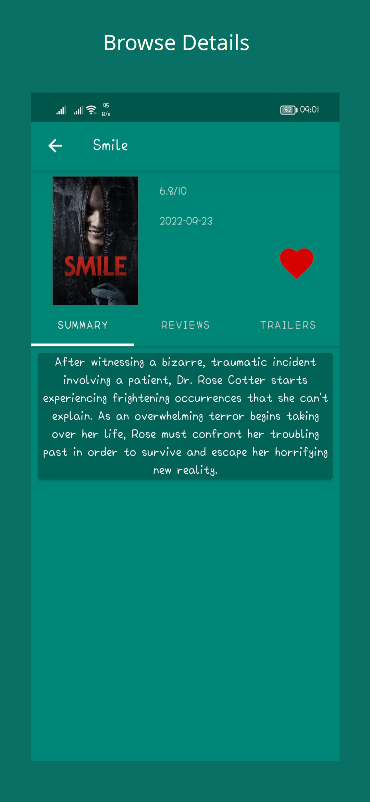

# TheMovieDB
* TheMovieDB App is movies app built with android architecture components and the repository pattern (LiveData, ViewModel, Room, Paging). 
* TheMovieDb API is used to fetch movie details.

## Screenshots

  
  
  
  
  

## Demo

  

## Downloads

[APK Download](https://drive.google.com/file/d/143OlLxI__qXpPiZsB145LXdyg8eGNRNf/view?usp=sharing)

## Resources

  - [Movie API](https://www.themoviedb.org/documentation/api)
  - [Android Developer Site](https://developer.android.com)

# Features and Tools

* [MVVM Arch](https://www.toptal.com/android/android-apps-mvvm-with-clean-architecture)
* [Retrofit](https://www.youtube.com/watch?v=t6Sql3WMAnk)
* [Kotlin Coroutines](https://kotlinlang.org/docs/coroutines-overview.html)
* [Room Database](https://developer.android.com/codelabs/android-room-with-a-view-kotlin#0)
* [Live Data](https://developer.android.com/reference/androidx/lifecycle/LiveData)
* [Navigation component](https://developer.android.com/guide/navigation/navigation-getting-started)
* [Dagger Hilt](https://developer.android.com/training/dependency-injection/hilt-android)
* [Testing](https://developer.android.com/codelabs/advanced-android-kotlin-training-testing-basics#0)
