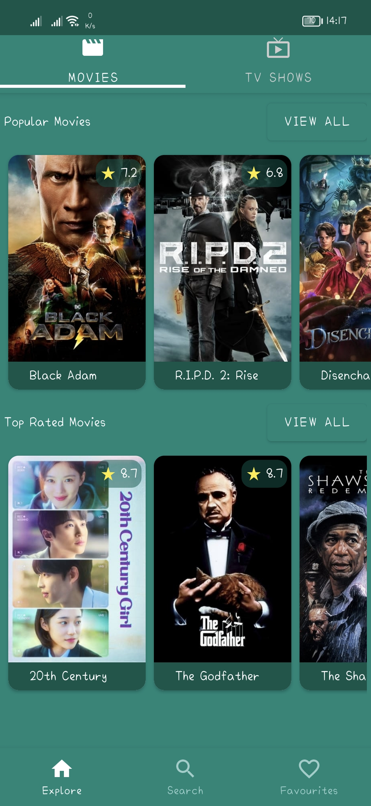
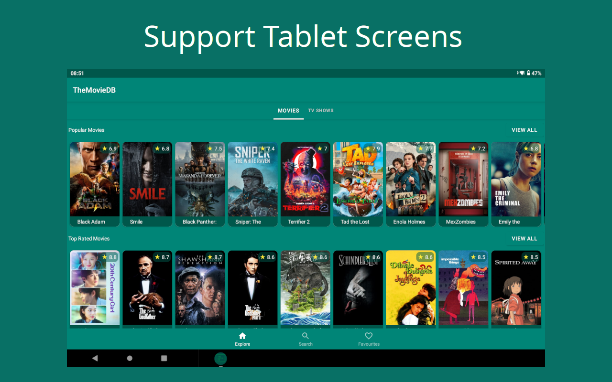

# TheMovieDB
An Android app that show popular movies and their details

## Screenshots

  
  
  
  
  

## Demo

  

## Downloads

## Resources

  - [Movie API](https://www.themoviedb.org/documentation/api)
  - [Android Developer Site](https://developer.android.com)
